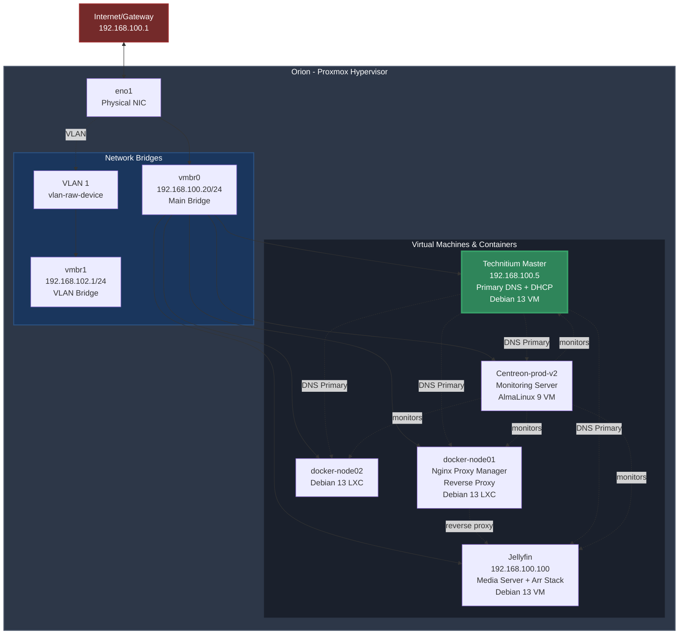

# Homelab

🫀 https://youtu.be/yoFTL0Zm3tw?si=L8GFws0YiC2Ms9ER

## Infrastructure

For my homelab, I use KISS (Keep it simple, stupid!) principle as much as possible.

**The Servers**

```shell
         .://:`              `://:.            root@orion
       `hMMMMMMd/          /dMMMMMMh`          ----------
        `sMMMMMMMd:      :mMMMMMMMs`           OS: Proxmox VE 9.1.6 x86_64
`-/+oo+/:`.yMMMMMMMh-  -hMMMMMMMy.`:/+oo+/-`   Host: 12TES0G72C ThinkCentre M70q Gen 5
`:oooooooo/`-hMMMMMMMyyMMMMMMMh-`/oooooooo:`   Kernel: 6.17.13-1-pve
  `/oooooooo:`:mMMMMMMMMMMMMm:`:oooooooo/`     Uptime: 1 day, 20 hours, 16 mins
    ./ooooooo+- +NMMMMMMMMN+ -+ooooooo/.       Packages: 1219 (dpkg)
      .+ooooooo+-`oNMMMMNo`-+ooooooo+.         Shell: bash 5.2.37
        -+ooooooo/.`sMMs`./ooooooo+-           CPU: Intel i5-14400T (16) @ 4.500GHz
          :oooooooo/`..`/oooooooo:             GPU: Intel Alder Lake-S GT1 [UHD Graphics 730]
          :oooooooo/`..`/oooooooo:             Memory: 12385MiB / 15622MiB
        -+ooooooo/.`sMMs`./ooooooo+-
      .+ooooooo+-`oNMMMMNo`-+ooooooo+.
    ./ooooooo+- +NMMMMMMMMN+ -+ooooooo/.
  `/oooooooo:`:mMMMMMMMMMMMMm:`:oooooooo/`
`:oooooooo/`-hMMMMMMMyyMMMMMMMh-`/oooooooo:`
`-/+oo+/:`.yMMMMMMMh-  -hMMMMMMMy.`:/+oo+/-`
        `sMMMMMMMm:      :dMMMMMMMs`
       `hMMMMMMd/          /dMMMMMMh`
         `://:`              `://:`
```

```shell
         .://:`              `://:.             root@orion-node02
       `hMMMMMMd/          /dMMMMMMh`           -----------------
        `sMMMMMMMd:      :mMMMMMMMs`            OS: Proxmox VE 9.1.7 x86_64
`-/+oo+/:`.yMMMMMMMh-  -hMMMMMMMy.`:/+oo+/-`    Host: OptiPlex Micro 7010
`:oooooooo/`-hMMMMMMMyyMMMMMMMh-`/oooooooo:`    Kernel: Linux 6.17.13-2-pve
  `/oooooooo:`:mMMMMMMMMMMMMm:`:oooooooo/`      Uptime: 3 hours, 19 mins
    ./ooooooo+- +NMMMMMMMMN+ -+ooooooo/.        Packages: 956 (dpkg)
      .+ooooooo+-`oNMMMMNo`-+ooooooo+.          Shell: bash 5.2.37
        -+ooooooo/.`sMMs`./ooooooo+-            Terminal: /dev/pts/1
          :oooooooo/`..`/oooooooo:              CPU: 13th Gen Intel(R) Core(TM) i5-13500T (20) @ 3.20 GHz
          :oooooooo/`..`/oooooooo:              GPU: Intel AlderLake-S GT1 @ 1.55 GHz [Integrated]
        -+ooooooo/.`sMMs`./ooooooo+-            Memory: 2.04 GiB / 15.31 GiB (13%)
      .+ooooooo+-`oNMMMMNo`-+ooooooo+.          Swap: Disabled
    ./ooooooo+- +NMMMMMMMMN+ -+ooooooo/.        Disk (/): 11.43 GiB / 232.73 GiB (5%) - ext4
  `/oooooooo:`:mMMMMMMMMMMMMm:`:oooooooo/`      Local IP (vmbr0): 192.168.100.22/24
`:oooooooo/`-hMMMMMMMyyMMMMMMMh-`/oooooooo:`    Locale: en_US.UTF-8
`-/+oo+/:`.yMMMMMMMh-  -hMMMMMMMy.`:/+oo+/-`
        `sMMMMMMMm:      :dMMMMMMMs`
       `hMMMMMMd/          /dMMMMMMh`
```

```shell
        _,met$$$$$gg.          root@orion-node02
     ,g$$$$$$$$$$$$$$$P.       -----------------
   ,g$$P""       """Y$$.".     OS: Debian GNU/Linux 13 (trixie) aarch64
  ,$$P'              `$$$.     Host: FriendlyElec NanoPi NEO3
',$$P       ,ggs.     `$$b:    Kernel: Linux 6.18.7-current-rockchip64
`d$$'     ,$P"'   .    $$$     Uptime: 5 days, 6 hours, 25 mins
 $$P      d$'     ,    $$P     Packages: 316 (dpkg)
 $$:      $$.   -    ,d$$'     Shell: bash 5.2.37
 $$;      Y$b._   _,d$P'       Terminal: dropbear
 Y$$.    `.`"Y$$$$P"'          CPU: rk3328 (4) @ 1.30 GHz
 `$$b      "-.__               Memory: 978.41 MiB / 1.93 GiB (50%)
  `Y$$b                        Swap: Disabled
   `Y$$.                       Disk (/): 9.48 GiB / 468.68 GiB (2%) - ext4
     `$$b.                     Local IP (eth0): 192.168.100.21/24
       `Y$$b.                  Locale: C.UTF-8
         `"Y$b._
             `""""
```

## Diagram



## Services:

None of these services are publicly available. I access everything using tailscale when not in localhost.

| Host              | Service                                               | IP              |
| ----------------- | ----------------------------------------------------- | --------------- |
| technitium-dns    | technitium                                            | 192.168.100.5   |
| centreon-prod-v2  | Centreon Central (Monitoring server)                  | 192.168.100.7   |
| jellyfin          | Jellyfin Media Server + arr-stack                     | 192.168.100.100 |
| VLMINECRAFT       | Minecraft server, powered by Crafty                   | 192.168.102.13  |
| docker-node01     | Nginx Proxy Manager                                   | 192.168.100.8   |
| orion-node02 (pi) | Sempahore                                             | 192.168.100.21  |
| orion-node02 (pi) | Grafana + promethus, Syncthing (master node) + Homarr | 192.168.100.21  |

Note: VLMINECRAFT runs in a totally isolated VLAN under the orion (primary proxmox host) and has no access to any other VMs or the host itself and is only accessible using a
tailscale VPN and a specific user, **root is disabled**
